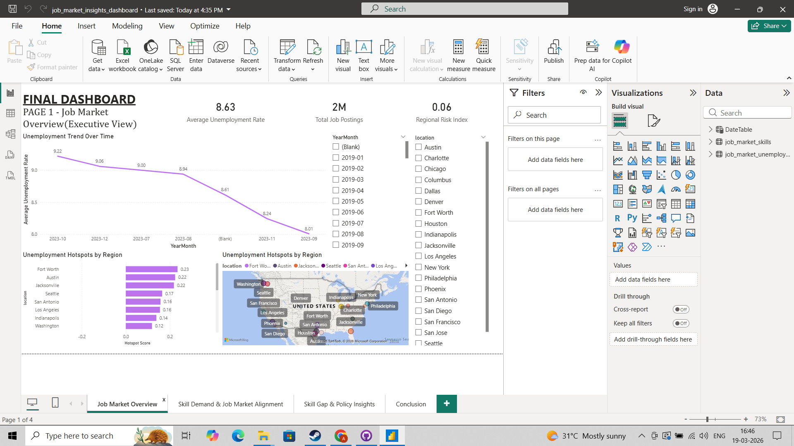
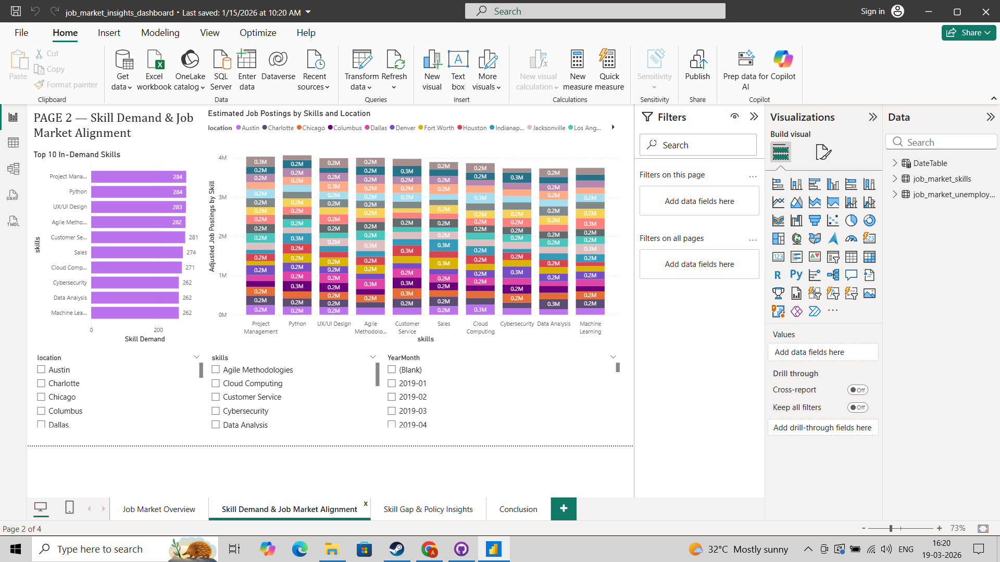
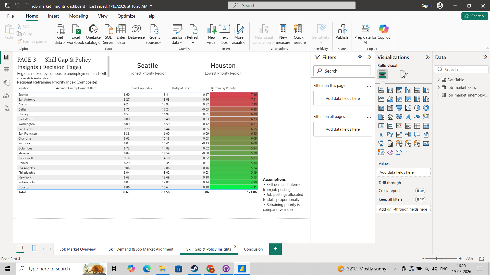
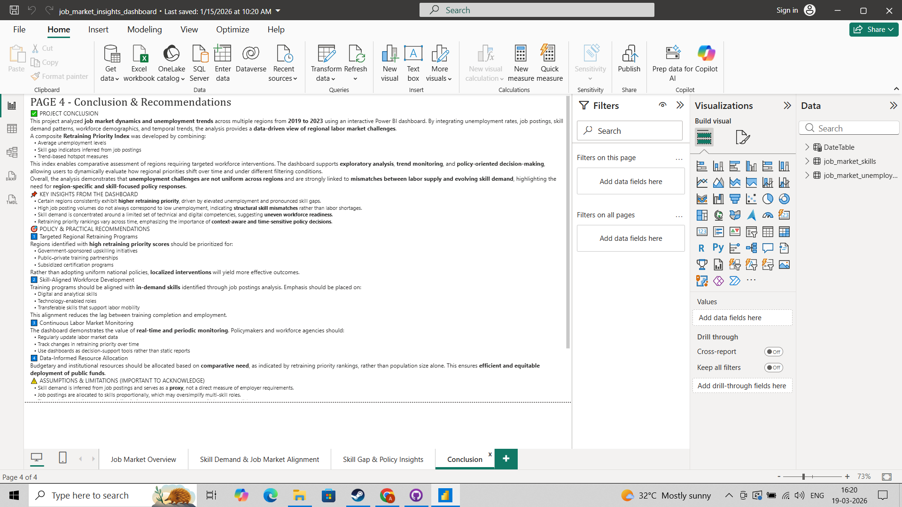

# 📊 Job Market Insights Dashboard
Data analysis and interactive dashboard on job market trends using Power BI

## 📌 Problem Statement
Understanding job market dynamics and unemployment trends is essential for workforce planning and policy-making. This project analyzes regional job market patterns to identify skill gaps and retraining priorities.

## 🎯 Objective
- Analyze unemployment trends over time
- Identify in-demand skills across regions
- Detect skill gaps in the workforce
- Provide data-driven policy insights

## 🛠 Tools Used
- Power BI

## 📁 Dataset

- **Source**: Job Market & Unemployment Trends Dataset (synthetic dataset for analysis from Kaggle)
- **Description**:  
  This dataset contains information on job market conditions across multiple locations over time. It includes unemployment rates, job postings, in-demand skills, and demographic indicators, enabling analysis of labor market dynamics and skill demand patterns.

## 📊 Features

- **id**: Unique identifier for each record  
- **date**: Date of observation (time-series data)  
- **location**: City or region of the job market data  
- **unemployment_rate**: Percentage of unemployed individuals in the region  
- **job_postings**: Number of job listings available  
- **in_demand_skills**: Skills most frequently requested by employers  
- **average_age**: Average age of the workforce in the region  
- **college_degree_percentage**: Percentage of population with a college degree  

## 📊 Dashboard Overview

### 1️⃣ Executive Overview

### 2️⃣ Skill Demand Analysis

### 3️⃣ Policy Insights & Skill Gap

### 4️⃣ Conclusion & Recommendations

## 📈 Key Insights

- Unemployment rates show a declining trend over time, indicating gradual recovery in the job market.
- High-demand skills include Python, Project Management, and UI/UX Design.
- Significant skill gaps exist between job requirements and workforce capabilities.
- Seattle has the highest retraining priority, while Houston has the lowest.
- Regional disparities highlight the need for targeted workforce policies.

## 🚀 Conclusion
This dashboard provides a comprehensive view of labor market dynamics and supports data-driven decision-making for workforce development and policy planning.

## 📌 Future Improvements
- Incorporate real-time job market data
- Enhance skill demand forecasting
- Deploy dashboard online for wider accessibility